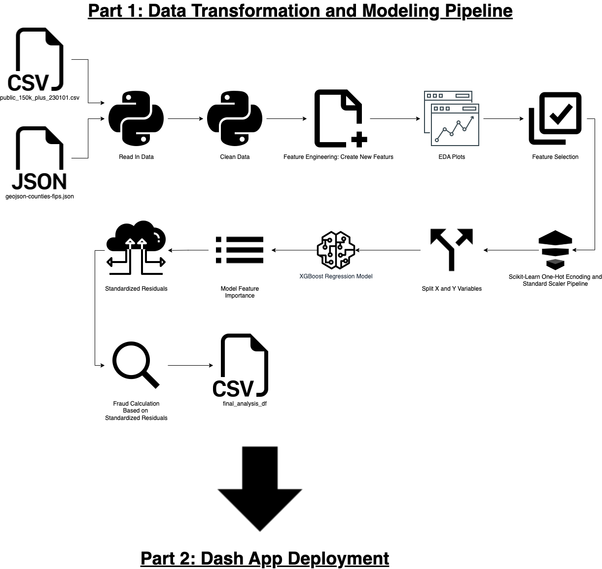

# Small Business Paycheck Protection Program Fraud Detection
## By: Carlos Monsivais

### Goal
The goal is to look for instances of loan fraud for the Small Business PPP  program. Since there are no labels indicating
whether each loan is fraudulent, I will use a XGBoost Regression modeling technique to analyze the model standardized 
residuals and look for outliers, which I will consider fraudulent.

### How to Execute
1. Download the datasets from the following links:
    * PPP Dataset: https://www.kaggle.com/datasets/nflovejoy/paycheck-protection-program-loan-data?select=public_150k_plus_230101.csv
    * GeoJson Dataset: https://github.com/plotly/datasets/blob/master/geojson-counties-fips.json

### Readings
* Standardized Residuals: http://www.stat.ucla.edu/~nchristo/introeconometrics/introecon_compute_sres_hat.pdf

* Standardized Residuals: https://online.stat.psu.edu/stat462/node/172/

### Project Diagram
